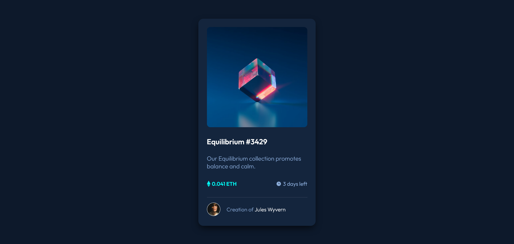

# Frontend Mentor - NFT preview card component solution

This is a solution to the [NFT preview card component challenge on Frontend Mentor](https://www.frontendmentor.io/challenges/nft-preview-card-component-SbdUL_w0U). Frontend Mentor challenges help you improve your coding skills by building realistic projects. 

## Table of contents

- [Overview](#overview)
  - [The challenge](#the-challenge)
  - [Screenshot](#screenshot)
  - [Links](#links)
- [My process](#my-process)
  - [Built with](#built-with)
  - [What I learned](#what-i-learned)
  - [Continued development](#continued-development)
  - [Useful resources](#useful-resources)
- [Author](#author)
- [Acknowledgments](#acknowledgments)

**Note: Delete this note and update the table of contents based on what sections you keep.**

## Overview

### The challenge

Users should be able to:

- View the optimal layout depending on their device's screen size
- See hover states for interactive elements

### Screenshot

### Links

- Solution URL: [Live Solution URL](https://www.frontendmentor.io/solutions/nft-preview-card-component-LWTts-o9zT)
- Live Site URL: [Live Site URL](https://delonekg-fem-nft.netlify.app/)

## My process

### Built with

- CSS custom properties
- Flexbox

### What I learned

I've learned to persevere and not give up. This challenge wasn't intense or that tough for me, but there's definitely some parts of the challenge which I struggled in. 

### Continued development

I'm aiming to learn more about semantic HTML and accessibility applied design. I'm hoping to learn more about CSS Flexbox & Grid. And overall become a better web developer.

### Useful resources

- [MDN Web Docs](https://developer.mozilla.org) This documentation website has helped me figure out what CSS properties I should be using.
- [Stackoverflow](https://stackoverflow.com/) Stackoverflow is a great website for asking questions if you're stuck!

## Author

- Frontend Mentor - [@delonekg](https://www.frontendmentor.io/profile/delonekg)
- Twitter - [@Deloneeeee](https://www.twitter.com/Deloneeeee)

## Acknowledgments

I recommend listening to some music and searching for help on Youtube if you're really stuck!